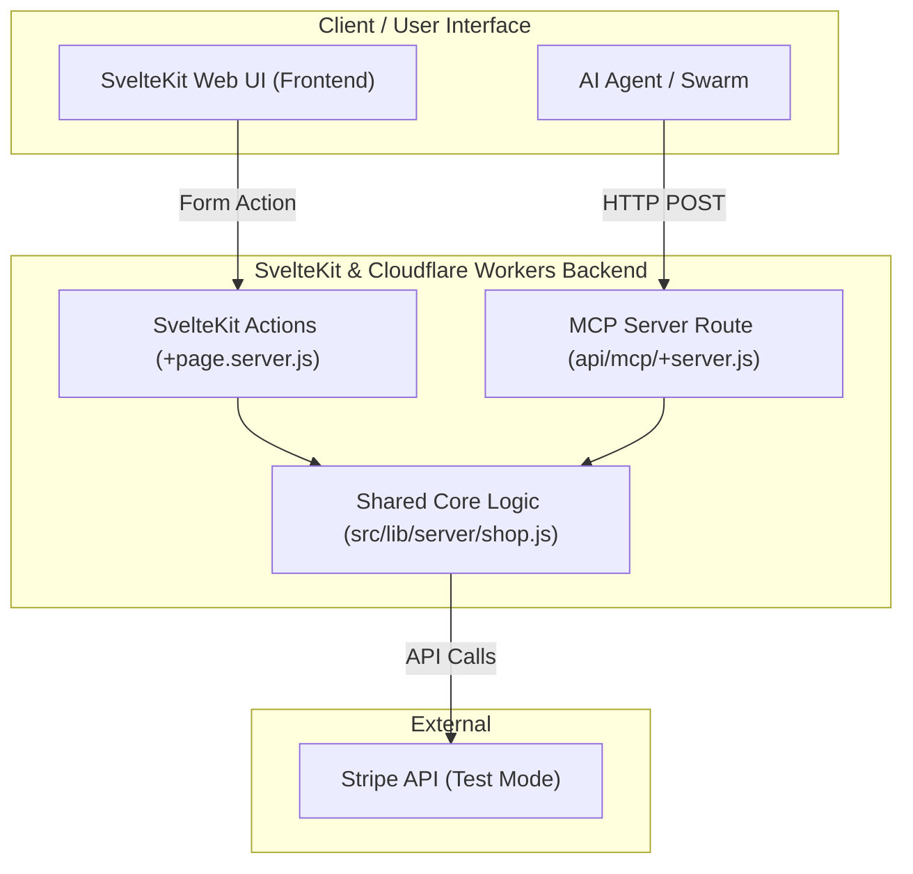
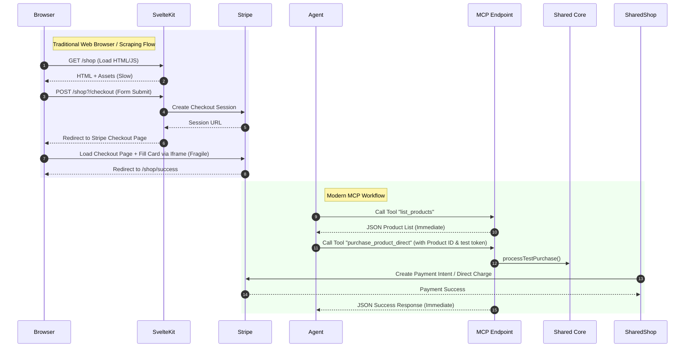

# Design Specification: MCP Server for Virtual Shop (fintechnick.com)

> **Note:** This document describes the initial design of the shop tools for the MCP server. The server has since been unified to include other tools (such as Genproj). For a complete overview of the unified MCP endpoint (`/api/mcp`), see [Unified MCP Server](unified-mcp-server.md).

This document outlines the architecture and design for exposing the `/shop` functionality of fintechnick.com as a Model Context Protocol (MCP) server. By doing so, autonomous AI agents can query products and execute checkout/payment simulations directly without the latency, cost, and flakiness associated with headless browser scraping (e.g. Stagehand, Playwright).

---

## 1. Architecture Overview

To ensure the web UI and the AI agents remain in sync, we adopt a **Shared Core Architecture**. Both the standard SvelteKit visual UI (+page.server.js form actions) and the MCP Server tools import and execute the exact same business logic from `src/lib/server/shop.js`.



---

## 2. Request Flow: Browser vs. MCP

The sequence diagram below contrasts the traditional visual DOM rendering flow with the streamlined, tool-driven MCP workflow.



---

## 3. MCP Tool Definitions

The MCP server will expose the following tools to the AI agents:

| Tool Name | Description | Arguments | Returns |
| --- | --- | --- | --- |
| `list_products` | Returns the list of products available in the shop with their metadata. | None | `Array<{ id: string, name: string, description: string, price: number, currency: string, category: string }>` |
| `get_product` | Returns detailed information about a single product by its ID. | `productId` (string, required) | Product object matching target ID |
| `purchase_product_direct` | Directly processes a purchase using Stripe test payment details. | `productId` (string, required), `stripeToken` (string, optional, defaults to `tok_visa`) | `{ success: boolean, orderId: string, chargeId: string }` |
| `create_checkout_session` | Creates a standard Stripe Checkout session URL. | `productId` (string, required) | `{ success: boolean, checkoutUrl: string, sessionId: string }` |
| `get_order_status` | Looks up the status of a specific order or payment. | `orderId` (string, required) | `{ success: boolean, status: string, amount: number, currency: string }` |

> [!NOTE]
> `purchase_product_direct` is the recommended path for automated regression testing, as it bypasses the visual checkout page redirection and processes the Stripe payment programmatically in a single round-trip.

---

## 4. Code Structure Design

### A. Shared Core Logic (`src/lib/server/shop.js`)
This module encapsulates all operations related to products and Stripe API integrations.

```javascript
// src/lib/server/shop.js
import Stripe from 'stripe';
import { env } from '$env/dynamic/private';
import { products } from '$lib/data/products.js';

function getStripeClient() {
	const stripeSecretKey = env.STRIPE_SECRET_KEY;
	if (!stripeSecretKey) {
		throw new Error('STRIPE_SECRET_KEY is not configured.');
	}
	return new Stripe(stripeSecretKey);
}

/**
 * Retrieve product by ID
 */
export function getProductById(productId) {
	return products.find((p) => p.id === productId) || null;
}

/**
 * Processes a Stripe payment directly using a test payment method token
 */
export async function processTestPurchase(productId, stripeToken = 'tok_visa') {
	const product = getProductById(productId);
	if (!product) {
		throw new Error('Product not found');
	}

	const stripe = getStripeClient();

	// Create a PaymentIntent to complete payment programmatically
	const paymentIntent = await stripe.paymentIntents.create({
		amount: product.price,
		currency: product.currency,
		payment_method: 'pm_card_visa', // Visa test card
		confirm: true,
		payment_method_types: ['card'],
		description: `Direct Agent Purchase: ${product.name}`,
		metadata: {
			productId: product.id,
			agentPurchase: 'true'
		}
	});

	return {
		success: paymentIntent.status === 'succeeded',
		orderId: `ord_${paymentIntent.id.substring(3, 12)}`,
		chargeId: paymentIntent.latest_charge
	};
}

/**
 * Creates a Stripe Checkout Session
 */
export async function createStripeSession(productId, originUrl) {
	const product = getProductById(productId);
	if (!product) {
		throw new Error('Product not found');
	}

	const stripe = getStripeClient();

	const session = await stripe.checkout.sessions.create({
		payment_method_types: ['card'],
		line_items: [
			{
				price_data: {
					currency: product.currency,
					product_data: {
						name: product.name,
						description: product.description
					},
					unit_amount: product.price
				},
				quantity: 1
			}
		],
		mode: 'payment',
		success_url: `${originUrl}/shop/success?session_id={CHECKOUT_SESSION_ID}`,
		cancel_url: `${originUrl}/shop/cancel`
	});

	return {
		success: true,
		checkoutUrl: session.url,
		sessionId: session.id
	};
}
```

### B. MCP Server Setup (`src/lib/server/mcp.js`)
Here we declare the MCP server instance, register resources/tools, and call the shared core logic.

```javascript
// src/lib/server/mcp.js
import { Server } from '@modelcontextprotocol/sdk/server/index.js';
import { CallToolRequestSchema, ListToolsRequestSchema } from '@modelcontextprotocol/sdk/types.js';
import { products } from '$lib/data/products.js';
import { getProductById, processTestPurchase, createStripeSession } from './shop.js';

export const mcpServer = new Server(
	{ name: 'fintechnick-shop', version: '1.0.0' },
	{ capabilities: { tools: {} } }
);

// Register Available Tools
mcpServer.setRequestHandler(ListToolsRequestSchema, async () => {
	return {
		tools: [
			{
				name: 'list_products',
				description: 'Returns the catalog of available products, categories, and prices.',
				inputSchema: { type: 'object', properties: {} }
			},
			{
				name: 'get_product',
				description: 'Returns metadata for a specific product by ID.',
				inputSchema: {
					type: 'object',
					properties: {
						productId: { type: 'string', description: 'ID of the product' }
					},
					required: ['productId']
				}
			},
			{
				name: 'purchase_product_direct',
				description: 'Completes a mock purchase directly via Stripe using test card credentials.',
				inputSchema: {
					type: 'object',
					properties: {
						productId: { type: 'string', description: 'ID of the product to purchase' },
						stripeToken: { type: 'string', description: 'Stripe token (defaults to tok_visa)' }
					},
					required: ['productId']
				}
			},
			{
				name: 'create_checkout_session',
				description: 'Generates a Stripe Checkout Session URL for visual completion.',
				inputSchema: {
					type: 'object',
					properties: {
						productId: { type: 'string', description: 'ID of the product' }
					},
					required: ['productId']
				}
			}
		]
	};
});

// Register Tool Execution Handler
mcpServer.setRequestHandler(CallToolRequestSchema, async (request) => {
	const { name, arguments: args } = request.params;

	try {
		switch (name) {
			case 'list_products': {
				return {
					content: [{ type: 'text', text: JSON.stringify(products) }]
				};
			}
			case 'get_product': {
				const product = getProductById(args.productId);
				if (!product) {
					return {
						isError: true,
						content: [{ type: 'text', text: `Product with ID "${args.productId}" not found.` }]
					};
				}
				return {
					content: [{ type: 'text', text: JSON.stringify(product) }]
				};
			}
			case 'purchase_product_direct': {
				const result = await processTestPurchase(args.productId, args.stripeToken);
				return {
					content: [{ type: 'text', text: JSON.stringify(result) }]
				};
			}
			case 'create_checkout_session': {
				// Origin is hardcoded or configured on the server
				const origin = 'https://www.fintechnick.com';
				const result = await createStripeSession(args.productId, origin);
				return {
					content: [{ type: 'text', text: JSON.stringify(result) }]
				};
			}
			default:
				throw new Error(`Tool not found: ${name}`);
		}
	} catch (err) {
		return {
			isError: true,
			content: [{ type: 'text', text: err instanceof Error ? err.message : String(err) }]
		};
	}
});
```

### C. SvelteKit API Endpoint Route (`src/routes/api/mcp/+server.js`)
Expose the MCP server via an HTTP POST endpoint, using `@cloudflare/agents/mcp`'s stateless Streamable HTTP wrapper.

```javascript
// src/routes/api/mcp/+server.js
import { createMcpHandler } from '@cloudflare/agents/mcp';
import { mcpServer } from '$lib/server/mcp.js';

// createMcpHandler translates Streamable HTTP payloads natively
const handler = createMcpHandler({
	server: mcpServer
});

/** @type {import('./$types').RequestHandler} */
export const POST = async ({ request }) => {
	// Exposes the standard Web Request payload to the Cloudflare agent handler
	return handler(request);
};
```

---

## 5. Deployment & Configuration Checklist

To implement this design, the following steps are required:

1. **Install Dependencies**:
  - `npm install @modelcontextprotocol/sdk` (MCP Server Framework)
  - `npm install @cloudflare/agents` (Cloudflare Workers MCP Streamable HTTP helper)
2. **Refactor existing `+page.server.js`**:
  - Move the Stripe Checkout Session creation from `+page.server.js` into the shared core `src/lib/server/shop.js`.
  - Update `+page.server.js` to call `createStripeSession(productId, url.origin)` to maintain DRY compliance.
3. **Configure private environment variables**:
  - Ensure `STRIPE_SECRET_KEY` is present in Cloudflare Wrangler secrets or Doppler.
4. **Agent Integration**:
  - Point your stagehand/headless-browser agent swarm to make HTTP POST requests to `https://www.fintechnick.com/api/mcp` with the MCP tool payload.

---

## 6. Pros & Cons of this Design

### Pros
- **Zero UI-change sensitivity**: AI Agents will not break when you update the page styling or DOM structure.
- **Extreme Speed**: Completing a payment drops from ~10–20 seconds (browser bootstrap, navigation, payment form iframe injection) to ~200 milliseconds (pure API execution).
- **Reduced Cost**: Bypasses the need for expensive headless browser execution runtimes.
- **Stateless & Edge-Compatible**: Fits perfectly within Cloudflare's serverless Worker architecture without requiring stateful connections (e.g. standard long-lived SSE).

### Cons
- **Bypasses UI Path Testing**: It does not test if a human can click the checkout button or if the CSS layout is broken (though this is typically the domain of E2E testing rather than backend transaction testing).
