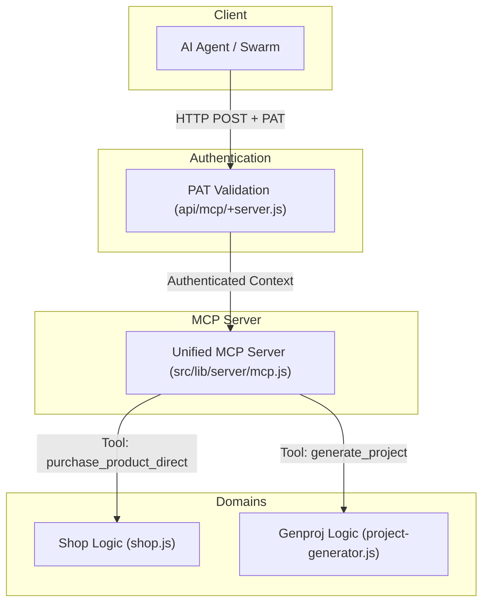

# Unified MCP Server Interface

This document outlines the architecture and design for the unified Model Context Protocol (MCP) server endpoint at `POST /api/mcp`. This single endpoint serves as the primary interface for autonomous AI agents to interact with various sub-systems, such as the fintechnick.com Virtual Shop and the Genproj code generator.

By consolidating multiple services under a single MCP endpoint, agents only require a single configuration to discover and use all available tools across the platform.

---

## 1. Architecture Overview

The unified MCP endpoint acts as a central registry and dispatcher. It authenticates requests via Personal Access Tokens (PAT) and routes tool calls to the appropriate shared core logic.



---

## 2. Authentication

The `POST /api/mcp` endpoint requires authentication via a Personal Access Token (PAT).
Agents must include the token in the `Authorization` header of their HTTP request:

```http
Authorization: Bearer <your-pat-token>
```

Tokens are validated against the `ApiKeys` table in the Cloudflare D1 database. If valid, the authenticated user's email is extracted and injected into the execution context (e.g., used by `genproj` to fetch user-specific OAuth tokens for GitHub, CircleCI, etc.).

---

## 3. MCP Tool Definitions

The unified server exposes tools from multiple domains.

### Shop Tools
These tools allow agents to query products and execute checkout/payment simulations directly without headless browser scraping.

| Tool Name | Description | Arguments | Returns |
| :--- | :--- | :--- | :--- |
| `list_products` | Returns the catalog of available products. | None | `Array<Product>` |
| `get_product` | Returns metadata for a specific product by ID. | `productId` (string, required) | `Product` |
| `purchase_product_direct` | Completes a mock purchase directly via Stripe using test card credentials. | `productId` (string, required), `stripeToken` (string, optional, defaults to `tok_visa`) | `{ success: boolean, orderId: string, chargeId: string }` |
| `create_checkout_session` | Generates a Stripe Checkout Session URL for visual completion. | `productId` (string, required) | `{ success: boolean, checkoutUrl: string, sessionId: string }` |

### Genproj Tools
These tools allow agents to interact with the project generation service to scaffold codebases and configure external integrations (e.g., GitHub, CircleCI, SonarCloud, Doppler).

| Tool Name | Description | Arguments | Returns |
| :--- | :--- | :--- | :--- |
| `list_genproj_capabilities` | Returns the list of supported capabilities that can be injected into a generated project. | None | `Array<Capability>` |
| `generate_project` | Triggers the generation of a new repository with selected capabilities. | `name` (string, required), `selectedCapabilities` (array of strings, required), `repositoryUrl` (string, optional), `overwrite` (boolean, optional) | `{ message: string, repositoryUrl: string }` |

---

## 4. Implementation Details

Since the `@modelcontextprotocol/sdk` handles requests statelessly, the unified `mcpServer` must be dynamically constructed or must accept a context (like `userEmail` and `platform.env.D1_DATABASE`) per request so that domain logic (like `genproj`) can access the database and user specific tokens.

In `webapp/src/routes/api/mcp/+server.js`, the authentication block extracts the user's identity and passes it alongside platform bindings into a factory method `createMcpServer(context)` which returns a customized server instance for that specific request.

```javascript
// src/routes/api/mcp/+server.js
import { createMcpServer } from '$lib/server/mcp.js';
import { createMcpHandler } from '@cloudflare/agents/mcp';

export const POST = async ({ request, platform }) => {
    // 1. Authenticate PAT
    // 2. Extract userEmail
    // 3. Create context-aware MCP server
    const server = createMcpServer({ userEmail, platform });
    const handler = createMcpHandler({ server });
    return handler(request);
};
```
