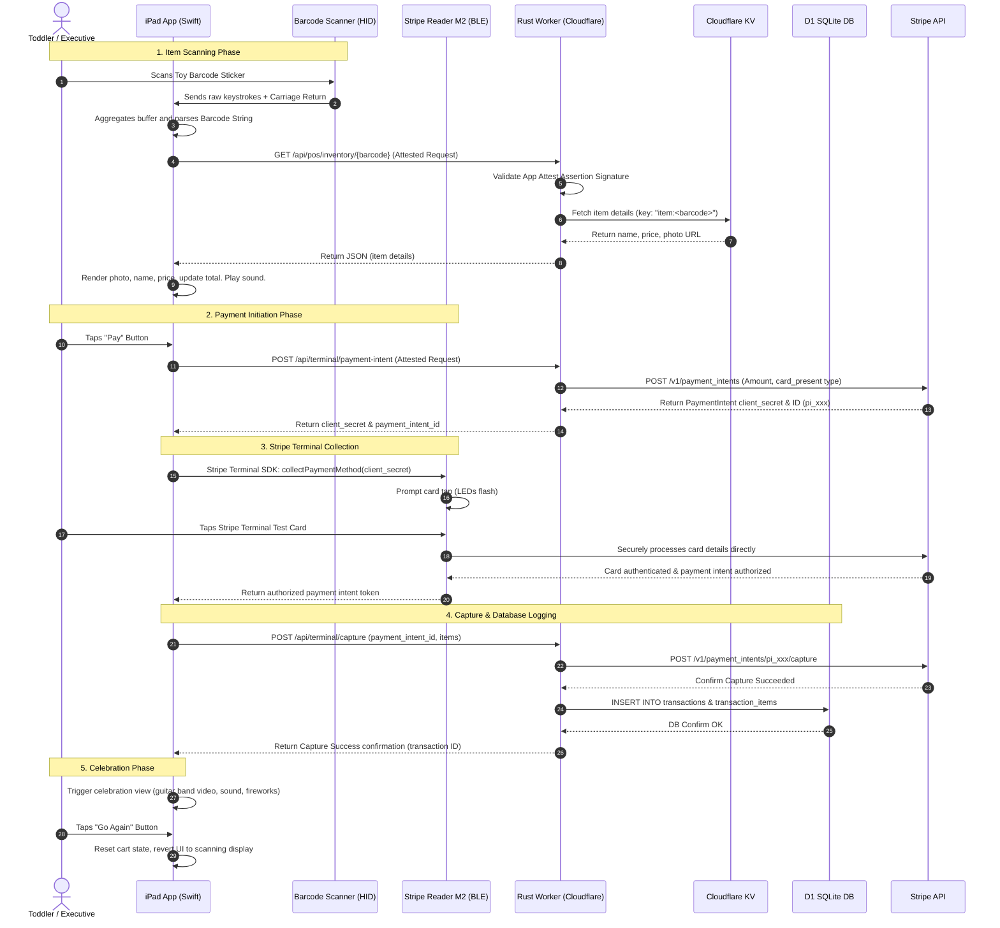

# Checkout Sequence Flow

This document details the network, Bluetooth, and internal system interactions during a standard POS transaction.

---

## Sequence Diagram

---

## Key Phase Breakdown

### 1. Item Scanning Phase
*   **Wedge interception**: The scanner operates as a secondary keyboard. The iPad app intercepts raw text input fast-buffer sequences to avoid triggering user-input fields.
*   **App Attest protection**: The GET query for item lookup is signed with the device's attested key to prevent arbitrary crawlers from scraping the inventory catalog.

### 2. Payment Initiation & Capture
*   **Stripe SDK direct communications**: During card reading (Step 13–15), the Stripe SDK on the iPad communicates directly with Stripe's card processing backend.
*   **Verification**: The backend capture step (Step 17–20) acts as the final ledger validator. It verifies that the captured card amount matches the sum of the inventory items in the cart before confirming write operations to D1.
