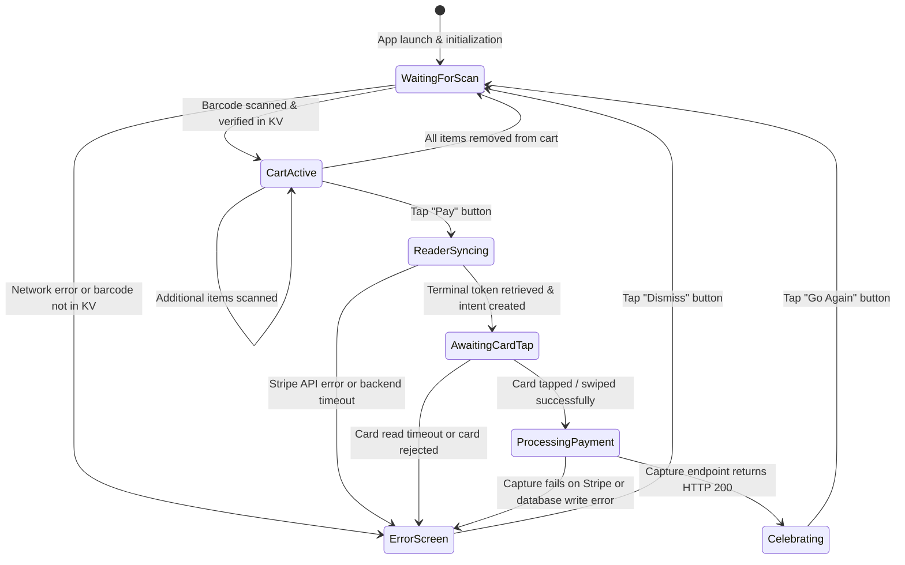
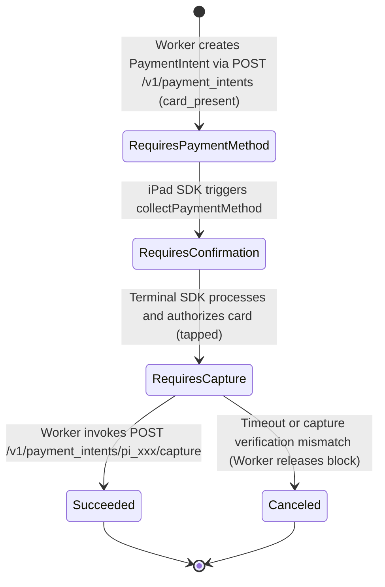
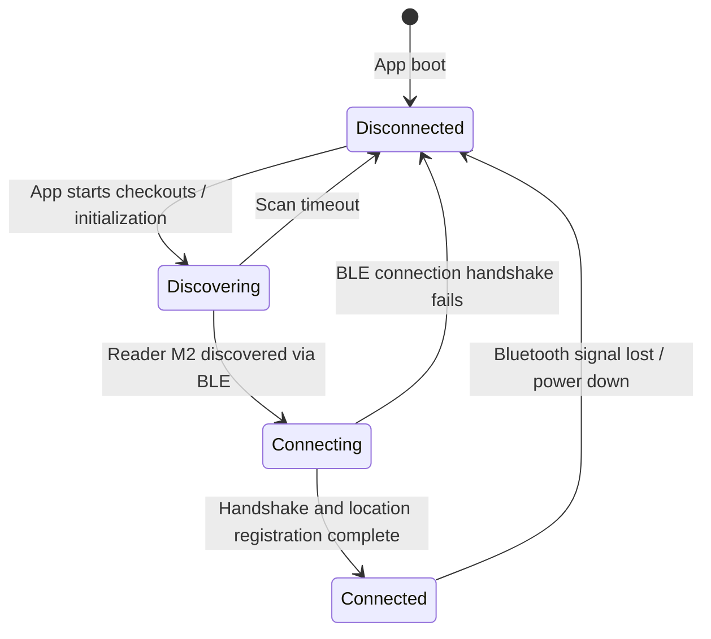

# Payment State Machine

This document defines the lifecycle states and state transition triggers for the iPad POS UI, the Stripe PaymentIntent, and the Stripe Terminal Bluetooth connection.

---

## 1. iPad POS User Interface States

---

## 2. Stripe PaymentIntent Lifecycle

This state machine traces the Stripe object state inside the Stripe engine.

---

## 3. Stripe Reader Bluetooth Connectivity States

Managed by the Stripe Terminal SDK on the iOS client.

---

## State Transition Conditions

### WaitingForScan $\rightarrow$ CartActive
*   **Trigger**: Barcode scanned.
*   **Action**: Backend lookup is successful. Item details are loaded. Sound effects play (e.g., electronic cash register beep).

### ReaderSyncing $\rightarrow$ AwaitingCardTap
*   **Trigger**: Connection token active and `payment_intent` created.
*   **Action**: Reader M2 LEDs flash. iPad displays "Please Tap Card".

### ProcessingPayment $\rightarrow$ Celebrating
*   **Trigger**: Server response from `/api/terminal/capture` returns HTTP 200.
*   **Action**: Play toddler reward animation (bouncing toy images, fireworks, loud celebratory sounds, guitar band video).
