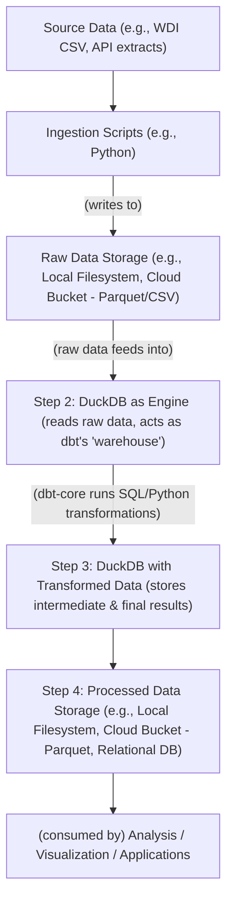

# Modern Data Transformation without a Data Warehouse: A dbt and DuckDB approach

**Link to code:** https://github.com/nickbrett1/dbt-duckdb

## 1. Introduction

Data transformation is a critical step in any data pipeline. For many use cases, cloud data warehouses offer powerful solutions, providing scalability for large datasets and easy access to analytical tools. However, this power often comes with increased complexity, cost, and maintenance overhead. At the other end of the spectrum, simple scripting with file formats like Parquet offers ease of use but can lack the robust structure needed for managing complex transformations as projects evolve.

This article addresses the gap between these two approaches. We present a solution for scenarios where datasets are manageable in size, yet there's a strong need for well-defined, maintainable transformations without incurring the costs and complexities of a full-scale data warehouse. We'll demonstrate how to build such a pipeline locally and deploy with minimal cloud infrastructure by leveraging the combined strengths of dbt-core and DuckDB.

## 3. The Complication: Common Hurdles

_(Content from section 3 would go here...)_

## 5. The Answer: dbt-core Meets DuckDB

### Part 3: The Combined Architecture

Here's a conceptual flow of how they interact:



### Part 4: Showcasing the Results (from the `dbt-duckdb` project)

The accompanying GitHub project provides a concrete implementation of this approach using World Development Indicator data. And below are some example visualizations of the transformed data:

- **Embedded Visualizations/Data (Illustrative):**
  - _(Placeholder: Imagine a line graph generated using a Python library like Matplotlib or Seaborn, plotting a key WDI indicator (e.g., GDP per capita) over time for selected countries. This graph would be generated by querying the final transformed data from the DuckDB instance.)_
  - _(Placeholder: Key summary statistics derived from the transformed data, such as the total number of countries processed, the range of years covered, and the count of unique indicators, could be presented here. For example: "Processed data for 217 countries across 50+ indicators from 1960 to 2022.")_

## 6. Appendix: Additional Considerations & Learnings

**A2: Leveraging `rclone` for Cloud Storage Agnosticity**
To manage the movement of data to and from cloud storage (like Cloudflare R2 in the example project), `rclone` ("rsync for cloud storage") proved to be an invaluable tool.

```bash
rclone sync /path/to/local/data remote:bucket/path --checksum
```
